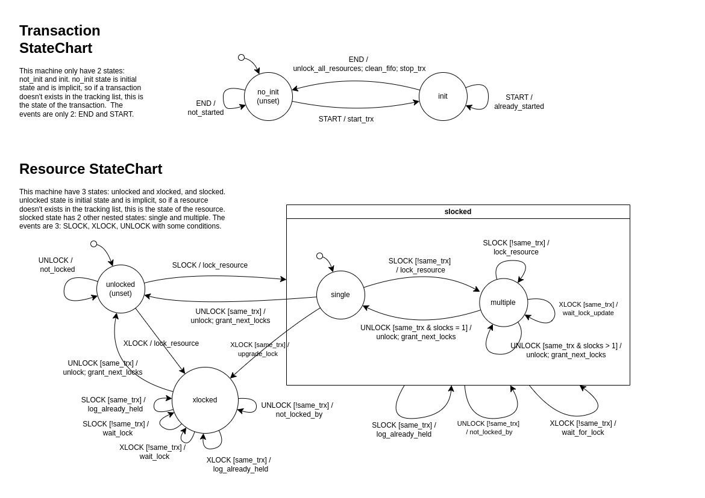

# Simple Lock Manager

A simple transaction lock manager implementation that processes lock requests through a command-line interface.

## Overview

This project implements a lock manager for database transactions, allowing you to:

- Start and commit transactions
- Request read (shared) and write (exclusive) locks on data items
- Manage lock conflicts between transactions

## Installation

### Prerequisites

- Python 3.6+

### Setup

1. Clone the repository:

```bash
git clone https://github.com/sytabaresa/db-lab2.git
```

2. Navigate to the project directory:

```bash
cd db-lab2
```

3. Install dependencies:

```bash
pip install -r requirements.txt
```

## Usage

### Creating in venv (optional)
You can create a python venv with:

```bash
python3 -m venv venv 
source venv/bin/activate 
```
This is good for development.

For deactivate onlhy execute:
```bash
deactivate 
```

### Running the Lock Manager CLI

You can run the lock manager in interactive mode:

```bash
PYTHONPATH=./src python src/cli/simple.py # if not using venv
python src/cli/simple.py # using venv
```

Or process commands from a file:

```bash
python src/cli/simple.py < commands.txt
```

Or pipe commands to it:

```bash
echo "Start 100" | python src/cli/simple.py
```

Or pipe entire files or stream directly:

```bash
cat commands.txt | python src/cli/simple.py
```

### Command Syntax

The lock manager accepts the following commands:

| Command                | Syntax                       | Description                                                                          |
| ---------------------- | ---------------------------- | ------------------------------------------------------------------------------------ |
| Start Transaction      | `Start <txn_id>`             | Starts a new transaction with the given ID                                           |
| End Transaction        | `End <txn_id>`               | Ends an active transaction, unlock all locked resources and clean waiting locks      |
| Request Share Lock     | `SLock <txn_id> <resource>`  | Requests a Read (shared) lock on a resource                                         |
| Request eXclusive Lock | `XLock <txn_id> <resource>`  | Requests a Write (exclusive) lock on a resource, or updates a previous shared lock |
| Unlock a resource      | `Unlock <txn_id> <resource>` | Requests an Unlock a previous locked resource, can be shared or exclusive            |

#### Examples:

```
Start 100
SLock 100 A
XLock 100 B
End 100

Start 200
SLock 200 A
SLock 200 C
End 200
```

you can also test already prepared flows in the folder `examples`:

```bash
cat examples/exercise.txt | python src/cli/simple.py
```

### Output

The lock manager will respond with one of the following:

- `Start <txn_id> : Transaction <txn_id> started` - When a transaction is successfully started
- `End <txn_id> : Transaction <txn_id> ended` - When a transaction is successfully ended
- `SLock|XLock <txn_id> <resource>', 'SLock <txn_id> <resource>: Lock granted` - When a shared or exclusive lock request is granted
- `SLock|XLock <txn_id> <resource>: Waiting for lock (<other_lock> held by: <other_txn_id>)` - When a shared or exclusive lock request keeps waiting until a conflicting lock on the same resource be unlocked
- `Unlock <txn_id> <resource>: Lock released` - When a resource is successfully unlocked
- `S-Lock|X-Lock granted to <txn_id>` - When a previously unlocked resource is automatically granted to the following (FIFO) waiting lock
- `Release X-lock|S-lock on <resource>` - When a resource lock are released when a transaction is ended
- `S-Lock|X-Lock on <resource> granted to <txn_id>` - When a previously released resource ends (by ending a transaction), and automatically granted to the following (FIFO) waiting lock
- `Upgraded to XL granted` - When a previous shared lock is updated to a exclusive lock
- `Upgraded to XL granted to <txn_id>` - When a previously released resource ends (by ending a transaction), and automatically upgraded to a waiting lock
- Error messages for invalid operations

## Error Handling

The lock manager handles various error conditions:

- Starting an already active transaction
- Ending a non-existent transaction
- Requesting locks for non-existent transactions
- Invalid input format
- Unlocking not locked resource
- Invalid command formats

## Development

To run tests:

```bash
pytest
```

## Design

This implementation is based in these FSMs:




## License

[MIT License](LICENSE)
